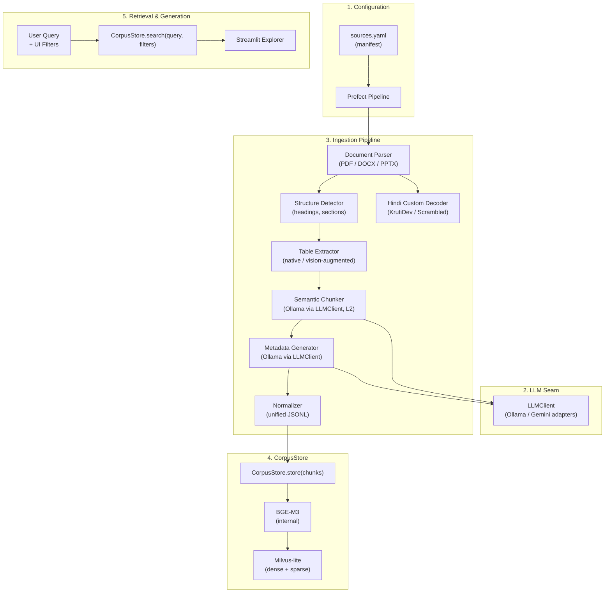

# T1D Bot — Multilingual Multi-Format RAG System (v2)

This repository contains the V2 implementation of the **Type 1 Diabetes (T1D) RAG Bot**. It is a Production-Grade Retrieval-Augmented Generation (RAG) system designed to ingest, process, index, and retrieve medical guidelines, textbooks, and patient education materials in both **English** and **Hindi**, across **PDF, DOCX, and PPTX** formats.

---

## 🏗️ Architecture Overview

The system consists of a config-driven ingestion pipeline, a unified document parsing layer, a hybrid dense-sparse vector store, and a Streamlit-based retrieval explorer.



---

## 🌟 Key Features of V2

1. **Unified Document Parsing:** Seamless parsing of **PDF** (via PyMuPDF), **DOCX** (via `python-docx`), and **PPTX** (via `python-pptx`) documents into a common Intermediate Representation (`DocumentPage`).
2. **Structure-Aware Semantic Chunking (L2):** Semantic chunking utilizing LLMs to preserve clinical protocols, dosages, and recommendations as coherent units.
3. **Hybrid Dense-Sparse Retrieval:** Powered by the **BGE-M3** embedding model (1024-dimensional dense vectors + token-weight sparse vectors) and indexed in **Milvus** with Reciprocal Rank Fusion (RRF) scoring.
4. **Bilingual Support (English & Hindi):** High-accuracy processing of Hindi documents, including automatic translation of legacy **KrutiDev** fonts and **custom scrambled PDF encodings**.
5. **Decoupled LLM Client:** A clean `LLMClient` abstraction supporting local models via **Ollama** and cloud APIs via **Gemini** (with automatic adapter selection).
6. **Local Desktop Portability:** Configured to run on Windows using **Milvus-lite** with an interactive **Streamlit** dashboard.

---

## ⚙️ Setup & Installation

### 1. Conda Environment
Activate or create the `t1d` conda environment:
```powershell
conda activate t1d
```

### 2. Install Dependencies
Install all required packages:
```powershell
pip install -r requirements.txt
```

### 3. Environment Variables (`.env`)
Create a `.env` file in the root directory:
```env
LLM_PROVIDER=ollama
CHUNKING_MODEL=gemma4:e4b
METADATA_MODEL=gemma4:e4b
GENERATION_MODEL=gemma4:e4b
EMBEDDING_MODEL=BAAI/bge-m3
MILVUS_HOST=t1d_corpus.db
MILVUS_PORT=19530
MILVUS_COLLECTION=t1d_corpus
OLLAMA_HOST=http://localhost:11434
```

---

## 🚀 Running Ingestion

The ingestion pipeline is config-driven and controlled by [sources.yaml](file:///C:/Users/SHREY/Desktop/t1d_bot/sources.yaml). It only processes documents with `status: pending`.

```powershell
# Run ingestion on all pending sources in sources.yaml
python -m src.pipeline.run

# Run a quick smoke-test (one PDF, one DOCX, one PPTX)
python -m src.pipeline.run --smoke-test

# Ingest a specific file
python -m src.pipeline.run --path "dataset/raw/ISPAD-English-2022/Ch1_Definition_Epidemiology.pdf"
```

---

## 💾 Local Database Migration (Windows)

Because Windows only supports **Milvus-lite 3.0** while Linux GPU pods write in **Milvus-lite 2.4.x**, copying the database directly will cause Milvus-lite 3.0 to reject and delete the `.parquet` segment files.

We provide a local migration script to rebuild the database in 3.0 format using the raw `.parquet` files:

1. **Compress & Download from Pod:**
   * On the GPU Pod / Headnode:
     ```bash
     tar -czvf t1d_corpus.tar.gz t1d_corpus.db
     ```
   * On your local Windows machine:
     ```powershell
     scp dgx-s-bmu-soet-230512@10.1.0.176:~/t1d_corpus.tar.gz .
     tar -xzvf t1d_corpus.tar.gz -C .
     ```
2. **Run the Migration:**
   Ensure the Streamlit app is closed (to release the file lock), then run:
   ```powershell
   python scratch/migrate_to_v3.py
   ```
   This will read the raw parquets, deserialize the BGE-M3 sparse vectors, insert them into a new Milvus 3.0 database, and replace the old folder.

---

## 🇮🇳 Hindi Custom Font Decoding

Many Hindi PDFs (such as the patient education booklet) use custom font layouts that extract as scrambled Devanagari text (e.g., `एं जक्टआग` instead of `इंजेक्शन`).

The V2 system solves this at two layers:
1. **Ingestion-Side ([pdf_parser.py](file:///C:/Users/SHREY/Desktop/t1d_bot/src/ingestion/parsers/pdf_parser.py)):** Text is automatically checked via `is_scrambled_hindi()` and translated back to clean Unicode Devanagari using [hindi_decoder.py](file:///C:/Users/SHREY/Desktop/t1d_bot/src/ingestion/hindi_decoder.py) before it is embedded by BGE-M3.
2. **Frontend-Side ([dashboard.py](file:///C:/Users/SHREY/Desktop/t1d_bot/src/dashboard.py)):** If you are using a database that was ingested with scrambled text, the Streamlit app applies the decoder on-the-fly when rendering the search results.

---

## 🖥️ Running the Retrieval Explorer UI

Launch the Streamlit dashboard to search the corpus, apply metadata filters, and inspect scores:

```powershell
streamlit run src/dashboard.py
```

### Dashboard Features:
* **Query Input:** Search for any T1D concept.
* **Sidebar Filters:** Filter by Collection ID, Language (English/Hindi), Content Type (Guideline, Textbook, Patient Education), and boolean flags (Dosage, Recommendation).
* **Source Authority Badges:** Displays relevance score, source document name, page number, and section title for every retrieved chunk.
* **On-the-fly Decoding:** Automatically decodes and displays scrambled Hindi text in clean Devanagari.

---

## 🧪 Running Tests

To run the unit and integration test suite:
```powershell
python -m pytest tests/
```
