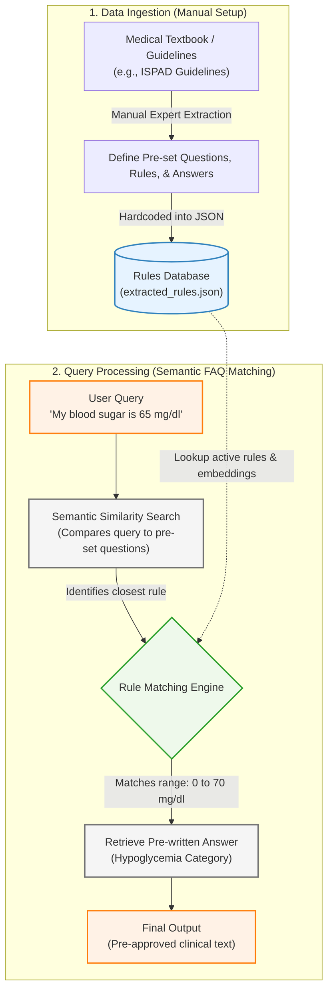
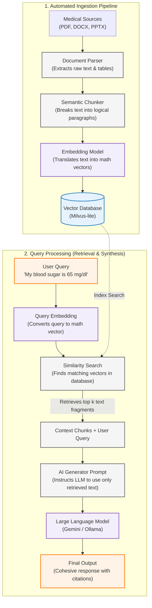

# Comparison of Hardcoded vs. Retrieval-Augmented Generation (RAG) Systems

---

## Analogy of the Two Systems

To understand these systems intuitively, consider the following analogies:

- **The Hardcoded System (The Semantic FAQ Catalog):** Like a medical clinic's physical binder of approved pamphlets. When a patient asks a question, the receptionist uses semantic similarity search to match the phrasing to the closest pre-set question in the binder, and reads the exact pre-approved text aloud. While it handles variations in phrasing better than keyword matching, it is still strictly limited to returning the pre-written static answers in the catalog.
- **The RAG System (The AI-Powered Research Librarian):** Like having a trained librarian with instant access to all medical textbooks, guidelines, and manuals. When a patient asks a question in any language or phrasing, the librarian searches the books for the most relevant paragraphs, reads them, and then summarizes the answer in natural language, citing the page numbers.

---

## 1. The Hardcoded & Rule-Based System

The hardcoded system relies on explicit rules and pre-defined mappings created manually by experts.

### High-Level Data Flow Chart

### Step-by-Step Example

**Scenario:** A patient submits the query: _"My blood sugar is 65 mg/dl, what should I do?"_

- **Step 1: User Query Input**
  The user inputs the natural language query into the interface.
- **Step 2: Vector Embedding Conversion**
  The system converts the natural language query into a mathematical vector representation using an embedding model.
- **Step 3: Semantic Similarity Search**
  The system compares the query vector against the pre-embedded vectors of the pre-set questions in the local database using cosine similarity.
- **Step 4: Closest Question Match**
  The system identifies the pre-set question with the highest semantic similarity score (e.g., matching the concept of treating a blood sugar level below 70 mg/dl).
- **Step 5: Output Retrieval**
  The system retrieves the exact, hardcoded answer mapped to that closest matching question and displays it directly to the user:
  > **Output:** _"Consume 15g of fast-acting carbohydrate and retest blood sugar in 15 minutes. If it is still below 70 mg/dl (3.9 mmol/L), consume another 15g of carbohydrate."_

---

## 2. The Retrieval-Augmented Generation (RAG) System

The RAG system automates document reading, indexation, and contextual question-answering using AI models.

### High-Level Data Flow Chart

### Step-by-Step Example

**Scenario:** A patient submits the query: _"My blood sugar is 65 mg/dl, what should I do?"_

- **Step 1: Automated Ingestion (Completed in Background)**
  The system reads the ISPAD Guidelines PDF. It parses the paragraphs, converts them into numeric coordinates called "embeddings" (representing semantic meaning), and stores them in the vector database.
- **Step 2: Query Embedding**
  The user enters the query. The system converts the query _"My blood sugar is 65 mg/dl, what should I do?"_ into an embedding vector using the **BGE-M3** AI model.
- **Step 3: Vector Database Search**
  The system compares the query's vector against the vector database using mathematical similarity metrics. It retrieves the top 3 most relevant textual passages (e.g., chunks from _Chapter 12: Pediatric Hypoglycemia_ describing the alert value of 70 mg/dl and the Rule of 15).
- **Step 4: Prompt Construction**
  The system builds a structured prompt containing the retrieved text (context) and the user's question:
  > _"Context: [Page 42, Ch 12: A glucose value <70 mg/dl is the alert threshold... Treat with 15g fast carbohydrate...]_
  > _Question: My blood sugar is 65 mg/dl, what should I do?_
  > _Instructions: Answer the question using only the context provided. Cite your sources."_
- **Step 5: Response Generation**
  The Large Language Model (LLM) reads the prompt and generates a natural, fluent response:
  > **Output:** _"Your blood sugar of 65 mg/dl is below the clinical alert threshold of 70 mg/dl (3.9 mmol/L). According to the ISPAD Guidelines (Ch. 12, p. 42), you should immediately treat this by consuming 15g of fast-acting carbohydrates (e.g., fruit juice or glucose tablets) and retest in 15 minutes."_

---

## 3. Detailed Pros and Cons Comparison

### The Hardcoded / Rule-Based Approach

| Pros                                                                                                                                                                                           | Cons                                                                                                                                                                                                                                  |
| :--------------------------------------------------------------------------------------------------------------------------------------------------------------------------------------------- | :------------------------------------------------------------------------------------------------------------------------------------------------------------------------------------------------------------------------------------ |
| **100% Deterministic & Safe:** For a given input, the system always returns the exact same, clinical-expert-approved answer. There is zero risk of "hallucinations" (the AI making things up). | **High Manual Maintenance:** Requires medical experts to manually write, review, and maintain the list of pre-set questions and corresponding approved answers.                                                                       |
| **Low Latency & High Speed:** Database/vector lookups occur in milliseconds, offering immediate responses without processing delay.                                                            | **Semantic Mismatch Risk:** While it handles phrasing variations better than strict keyword matching, it can falsely match a query to an incorrect pre-set question if they share similar vocabulary but different clinical contexts. |
| **No Operating Cost:** Does not require expensive GPUs, cloud server subscriptions, or API usage fees for LLMs.                                                                                | **Limited Expressiveness:** Cannot synthesize information from multiple chapters or translate complex instructions on the fly. It can only return pre-written static text.                                                            |
| **Easily Auditable:** Regulators (like FDA or CE marking authorities) can review every pre-set question-answer pair to guarantee safety.                                                       | **Difficult to Scale:** Creating pre-set questions and answers for thousands of pages of medical text across multiple languages (e.g., English and Hindi) is practically impossible.                                                  |

---

### The RAG (Retrieval-Augmented Generation) Approach

| Pros                                                                                                                                                                                                                        | Cons                                                                                                                                                                                                                    |
| :-------------------------------------------------------------------------------------------------------------------------------------------------------------------------------------------------------------------------- | :---------------------------------------------------------------------------------------------------------------------------------------------------------------------------------------------------------------------- |
| **Natural & Flexible Interface:** Understands colloquial language, spelling mistakes, synonyms, and conversational queries (e.g., understands that "low glucose", "sugar crash", and "65 mg/dl" refer to the same concept). | **Risk of Hallucinations / Mistakes:** LLMs are statistical models and can occasionally generate incorrect explanations or misinterpret numbers, which is a major concern in a medical context where errors are costly. |
| **Scale & Automation:** New textbooks, guidelines, and manuals can be integrated automatically. The pipeline extracts, embeds, and indexes thousands of pages in minutes without manual rule writing.                       | **Higher Latency:** Converting queries into embeddings and waiting for the LLM to generate a natural language response takes seconds, which is slower than a database lookup.                                           |
| **Information Synthesis:** Can retrieve sections from separate documents (e.g., combining a section on food guidelines with a section on insulin calculations) and merge them into one cohesive answer.                     | **Higher Operating Costs:** Requires GPU hardware (either locally or via cloud APIs like Gemini/Ollama) to compute embeddings and generate text.                                                                        |
| **Multilingual Support:** The system can match queries in one language (e.g., Hindi) to source documents in another (e.g., English) and generate the response in the user's preferred language.                             | **Harder to Formally Verify:** Because LLMs generate responses dynamically, it is challenging to test and prove to medical regulators that the bot will never generate unsafe advice.                                   |

---
