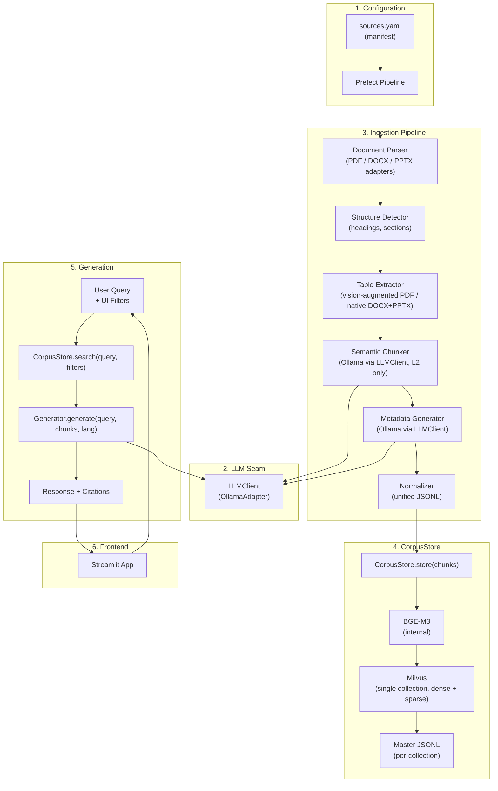

# T1D RAG Bot — Redesign Plan (v2)

> Fresh start in `` on `main` branch. Expanding from structured ISPAD-only PDFs to a diverse, multilingual, multi-format corpus with a repeatable ingestion pipeline. Current codebase preserved in `v1` branch; `` promoted to repo root once v1 logic is no longer needed.

---

## Decision Log

| # | Area | Decision |
|---|---|---|
| 1 | Parsing | Unified parser abstraction (PyMuPDF + python-docx + python-pptx) → common `DocumentPage` IR |
| 2 | Tables | Critical — robust extraction (vision-augmented for PDFs, native for DOCX/PPTX) |
| 3 | Structure Detection | Format-native heuristics (DOCX heading styles, PDF font-size, PPTX slide titles). Drop ISPAD-specific rules |
| 4 | Chunking | L2 semantic chunking only. Drop L3 atomic extraction. Design for optional re-addition |
| 5 | Embedding | Switch from `multilingual-e5-large` → **BGE-M3** (8K context, hybrid dense+sparse) |
| 6 | Vector DB | Keep Milvus. Add sparse vector fields for BGE-M3 hybrid search |
| 7 | Bilingual | Embed in original language. Cross-lingual retrieval via BGE-M3. _Future: query-time translation fallback_ |
| 8 | Metadata | Universal schema: `source_document`, `collection`, `language`, `topic`, `content_type`, `keywords`, `contains_dosage`, `contains_recommendation` |
| 9 | Retrieval | BGE-M3 hybrid (dense + sparse) + metadata pre-filtering. No re-ranker |
| 10 | Query Filtering | Manual UI filters (Streamlit sidebar checkboxes) |
| 11 | Generation LLM | Ollama (local only). Model per task configurable via env/config |
| 12 | Citations | `Source: [Document Name], p.XX-YY` format |
| 13 | Pipeline | Config-driven YAML manifest + **Prefect** orchestration |
| 14 | Collection | Single Milvus collection, metadata filtering at query time |
| 15 | Document Grouping | Logical `collection` field in manifest (e.g., "ISPAD 2022", "Understanding Diabetes") |
| 16 | Scope | T1D-only. Filter non-T1D content via manual page ranges in manifest |
| 17 | Project Start | **Fresh start** in `` on `main` branch. Current codebase preserved in `v1` branch. Port ~300 lines from v1: PyMuPDF table extraction patterns, checkpoint/resume logic, dosage/recommendation regex patterns. Once v2 is verified, old root-level code removed and `` contents promoted to repo root |
| 18 | Evaluation | Deferred — manual testing initially |
| 19 | Frontend | Enhanced Streamlit with filters, source indicators, language toggle |
| 20 | API Flexibility | Superseded by Decision #22 (LLMClient seam) |
| 21 | PPTX Support | `python-pptx` parser backend. Extract visible slide text + tables natively + images via Ollama vision. Slide titles as section headings. Slide number = page number for citations. No speaker notes. Full text fed through standard pipeline (structure detection → L2 chunking → metadata) |
| 22 | LLM Abstraction | `LLMClient` seam in `src/llm/`. `OllamaAdapter` and `GeminiAdapter` are the concrete implementations now; `OpenAIAdapter` is a future ~20-line addition. All LLM-calling modules (Chunker, MetadataGenerator, Generator) import `LLMClient` — no raw calls outside `src/llm/` |
| 23 | CorpusStore | `embedding.py`, `storage.py`, and `kv_store.py` replaced by a single `CorpusStore` module in `src/corpus_store/`. Interface: `store(chunks) → int` and `search(query, filters, top_k) → list[SearchResult]`. BGE-M3 and Milvus are implementation details. Dead `kv_store` L3 path is not ported |
| 24 | Generator | `prompt_builder.py` and `generate.py` merged into a single `Generator` module in `src/generation/`. Interface: `generate(query, retrieved_chunks, language) → Response`. Prompt construction is implementation, not interface |
| 25 | Hindi Encoding | Handled natively at the Parser layer (PDF, DOCX, PPTX). If language=hindi, uses a heuristic guard (`is_likely_krutidev`) to convert legacy KrutiDev text to Unicode Devanagari on a per-page/slide basis, avoiding corruption of pure English text |
| 26 | Vector DB Hosting | Run Milvus, MinIO, etcd, Attu inside WSL2 Docker CE for lightweight hosting; Windows client connects via localhost |

---

## Architecture Overview



---

## Phase 1: Pipeline Foundation

### 1.1 Source Manifest (`sources.yaml`)

The manifest is the single source of truth for what documents exist and how to process them.

```yaml
# sources.yaml
defaults:
  chunking_model: "${CHUNKING_MODEL}"  # from .env
  metadata_model: "${METADATA_MODEL}"  # from .env

collections:
  - name: "ISPAD 2022 Guidelines"
    id: ispad_2022
    content_type: guideline
    language: english
    sources:
      - path: "dataset/raw/ISPAD-English-2022/Ch1_Definition_Epidemiology.pdf"
        format: pdf
        status: pending  # pending | processing | processed | error
      - path: "dataset/raw/ISPAD-English-2022/Ch2_Stages_of_T1D.pdf"
        format: pdf
        status: pending
      # ... all 19 chapters

  - name: "Understanding Diabetes Series"
    id: understanding_diabetes
    content_type: patient_education
    language: english
    sources:
      - path: "dataset/Expanded New Dataset/understanding diabetes/ud01.pdf"
        format: pdf
        status: pending
      # ... all 28 parts

  - name: "Williams Endocrinology"
    id: williams_endo
    content_type: textbook
    language: english
    sources:
      - path: "dataset/Expanded New Dataset/Williams Endocrinology New Edition.pdf"
        format: pdf
        include_pages: "850-920,1100-1180"  # T1D chapters only
        status: pending

  - name: "Hindi Patient Booklet"
    id: hindi_booklet
    content_type: patient_education
    language: hindi
    sources:
      - path: "dataset/Expanded New Dataset/Final Hindi booklet.pdf"
        format: pdf
        status: pending

  - name: "Diabetes Ward Education"
    id: ward_education
    content_type: patient_education
    language: english
    sources:
      - path: "dataset/Expanded New Dataset/diabetes education full for ward 18.8.15.docx"
        format: docx
        status: pending

  - name: "RSSDI Nutrition Guidelines"
    id: rssdi_nutrition
    content_type: guideline
    language: english
    sources:
      - path: "dataset/Expanded New Dataset/RSSDI Nutrition guidelines_PrintPDF.pdf"
        format: pdf
        status: pending

  - name: "Sperling Pediatric Endocrinology"
    id: sperling_ped_endo
    content_type: textbook
    language: english
    sources:
      - path: "dataset/Expanded New Dataset/Sperling Pediatric Endocrinology 5th ed 2021.pdf"
        format: pdf
        include_pages: "TBD"  # identify T1D chapters
        status: pending

  - name: "Brooks Pediatric Endocrinology"
    id: brooks_ped_endo
    content_type: textbook
    language: english
    sources:
      - path: "dataset/Expanded New Dataset/Brooks Ped Endocrinology 7th Edn.pdf"
        format: pdf
        include_pages: "TBD"  # identify T1D chapters
        status: pending

  - name: "Carb Counting Guide"
    id: carb_counting
    content_type: patient_education
    language: english
    sources:
      - path: "dataset/Expanded New Dataset/Nutrition basics and a quick guide to carbohydrate counting.pdf"
        format: pdf
        status: pending

  - name: "ISPAE Diabetes Guidelines 2017"
    id: ispae_2017
    content_type: guideline
    language: english
    sources:
      - path: "dataset/raw/ISPAE-Diabetes-Guidelines-2017.pdf"
        format: pdf
        status: pending

  - name: "DSMES Education Modules"
    id: dsmes_modules
    content_type: patient_education
    language: english
    sources:
      - path: "dataset/Expanded New Dataset/DSMES Modules/Admission and Discharge teaching.pptx"
        format: pptx
        status: pending
      - path: "dataset/Expanded New Dataset/DSMES Modules/NEW DSMES Session 1.pptx"
        format: pptx
        status: pending
      - path: "dataset/Expanded New Dataset/DSMES Modules/NEW DSMES Session 2.pptx"
        format: pptx
        status: pending
      - path: "dataset/Expanded New Dataset/DSMES Modules/NEW DSMES Session 3.pptx"
        format: pptx
        status: pending
```

### 1.2 Environment Configuration (`.env`)

```env
# LLM Provider (ollama | gemini)
LLM_PROVIDER=ollama

# LLM Models (Ollama / Gemini)
CHUNKING_MODEL=gemma4:e4b
METADATA_MODEL=gemma4:e4b
GENERATION_MODEL=gemma4:e4b

# Embedding
EMBEDDING_MODEL=BAAI/bge-m3

# Milvus
MILVUS_HOST=localhost
MILVUS_PORT=19530
MILVUS_COLLECTION=t1d_corpus

# Ollama
OLLAMA_HOST=http://localhost:11434

# Gemini / OmniKey
GEMINI_API_KEY=your_omnikey_api_key
```

---

## Phase 2: LLMClient Seam

This phase is built first — before any pipeline module — because Chunker, MetadataGenerator, and Generator all depend on it. No module outside `src/llm/` ever calls `ollama.chat()` directly.

### 2.1 Module Structure

```
src/llm/
├── __init__.py      # exports get_llm_client()
├── client.py        # LLMClient abstract base class
├── ollama.py        # OllamaAdapter (concrete implementation)
└── gemini.py        # GeminiAdapter (concrete implementation)
```

### 2.2 Interface

```python
# src/llm/client.py
from abc import ABC, abstractmethod

class LLMClient(ABC):
    @abstractmethod
    def chat(self, messages: list[dict], model: str, temperature: float = 0.1) -> str:
        """Send messages to the LLM, return the response string."""
        ...
```

```python
# src/llm/ollama.py
import ollama
from .client import LLMClient

class OllamaAdapter(LLMClient):
    def __init__(self, host: str = "http://localhost:11434"):
        self._host = host

    def chat(self, messages: list[dict], model: str, temperature: float = 0.1) -> str:
        response = ollama.chat(
            model=model,
            messages=messages,
            options={"temperature": temperature},
        )
        return response["message"]["content"]
```

```python
# src/llm/__init__.py
import os
from .client import LLMClient
from .ollama import OllamaAdapter

def get_llm_client() -> LLMClient:
    provider = os.getenv("LLM_PROVIDER", "ollama")
    if provider == "ollama":
        return OllamaAdapter(host=os.getenv("OLLAMA_HOST", "http://localhost:11434"))
    raise ValueError(f"Unknown LLM provider: {provider}")
```

Future adapters (`OpenAIAdapter`) are ~20-line implementations of `LLMClient.chat()`. Adding a new provider requires no changes outside `src/llm/`.

---

## Phase 3: Document Parsing Layer

### 3.1 Unified Parser Abstraction

```
src/ingestion/
├── parsers/
│   ├── __init__.py
│   ├── base.py          # Abstract base class + DocumentPage model
│   ├── pdf_parser.py    # PyMuPDF backend (ports extraction patterns from v1)
│   ├── docx_parser.py   # python-docx backend
│   └── pptx_parser.py   # python-pptx backend
├── krutidev.py            # KrutiDev to Unicode converter + heuristic guards
├── structure_detector.py  # Generic — replaces ISPAD-specific chapter_detector
├── table_extractor.py     # Robust table extraction with vision fallback
├── chunker.py             # L2 only, uses LLMClient (ports checkpoint/resume from v1)
├── metadata_generator.py  # Universal schema, uses LLMClient (ports regexes from v1)
└── normalize.py           # Unified JSONL output
```

**Intermediate Representation** (`DocumentPage`):

```python
@dataclass
class DocumentPage:
    page_number: int
    text_blocks: list[TextBlock]  # text + font_size + is_bold
    tables: list[str]             # markdown-formatted tables
    source_path: str

@dataclass
class TextBlock:
    text: str
    font_size: float
    is_bold: bool
    bbox: tuple[float, float, float, float] | None  # PDFs only
```

**PDF backend**: PyMuPDF extraction. Applies `include_pages` filtering from manifest. Table extraction patterns ported from v1 `pdf_extractor.py`.

**DOCX backend**: `python-docx` paragraphs with heading levels + native table extraction.

**PPTX backend**: `python-pptx` slide content. Each slide → one `DocumentPage` (slide number = page number). Extracts text from shape placeholders, tables from table shapes (markdown-formatted), and embedded images via Ollama vision. Speaker notes ignored.

**Hindi Handling**: All parsers accept a `language` argument. If `hindi`, they run a per-page/slide heuristic (`is_likely_krutidev` + `has_devanagari`). If legacy KrutiDev encoding is detected, it is translated inline to Unicode Devanagari. Pure English pages are skipped.

### 3.2 Structure Detector

**File**: `src/ingestion/structure_detector.py`

- **DOCX**: Read heading styles directly (`Heading 1`, `Heading 2`, etc.)
- **PDF**: Generalized font-size heuristic — text block with font size significantly above median = heading. No hardcoded patterns
- **PPTX**: Slide title placeholders as section headings
- **Output**: `list[Section(title, level, start_page, end_page, content)]`

No ISPAD-specific constants — no `FORCED_SECTION_HEADINGS`, `SKIP_TITLES`, or noise filters for "LIBMAN ET AL" / Wiley URLs.

### 3.3 Table Extraction

**File**: `src/ingestion/table_extractor.py`

- **DOCX**: `python-docx Document.tables` — native, handles merged cells
- **PDF simple tables**: PyMuPDF `page.find_tables()` (ported from v1)
- **PDF complex tables** (merged cells, spanning headers): Image crop of table region → Ollama vision model → markdown conversion
- **PPTX**: `python-pptx` table shapes — native, same approach as DOCX
- Tables are atomic units in chunking — never split across chunks

---

## Phase 4: Chunking & Metadata

### 4.1 Semantic Chunker (L2 Only)

**File**: `src/ingestion/chunker.py`

- Uses `LLMClient` from `src/llm/` — no direct `ollama.chat()` calls
- Content-type-aware chunking prompt:
  - `guideline`: preserve protocols, dosages, recommendations as complete units
  - `textbook`: preserve explanatory coherence, keep examples with concepts
  - `patient_education`: simple, self-contained chunks
- Checkpoint/resume logic ported from v1 (JSONL progress tracking, skip-if-exists) — valuable for large textbook runs
- Generic `skip_sections` field in manifest per source (replaces hardcoded ISPAD skip list)
- L3 removed. Output schema includes `child_ids: []` placeholder for optional future re-addition

> **Designing for L3 re-addition**: The `children` field is an empty list in all output. If L3 is re-added later, it populates this field. Normalizer and CorpusStore handle `children=[]` gracefully.

### 4.2 Metadata Generator

**File**: `src/ingestion/metadata_generator.py`

Uses `LLMClient` from `src/llm/`.

**Universal schema** (per chunk):

```python
@dataclass
class ChunkMetadata:
    # Source identity
    source_document: str      # filename
    collection: str           # from manifest (e.g., "ispad_2022")
    content_type: str         # guideline | textbook | patient_education
    language: str             # english | hindi

    # Semantic
    topic: str                # expanded list (see below)
    keywords: list[str]       # LLM-generated

    # Clinical flags (regex-based — ported from v1)
    contains_dosage: bool     # regex: numeric + clinical unit
    contains_recommendation: bool  # regex: should, must, recommend, protocol
```

**Expanded topic list**:
```
screening, diagnosis, monitoring, insulin_therapy, hypoglycemia,
hyperglycemia, DKA, complications, epidemiology, nutrition,
exercise, technology, psychosocial, sick_day_management,
surgery, travel, pregnancy, general
```

**Regex patterns** (ported from v1 `metadata_generator.py`):
- `contains_dosage`: `\d+(\.\d+)?\s*(mg|mcg|IU|units|mmol|mL|kg)`
- `contains_recommendation`: `\b(should|must|recommend|protocol|administer|initiate)\b`

These remain regex-based — reliable and language-agnostic for English; patterns extended for Hindi as needed.

---

## Phase 5: CorpusStore

Replaces the separate embedding, storage, and retrieval modules from the previous architecture. BGE-M3 and Milvus are implementation details hidden behind two methods. Callers (Prefect flow and `app.py`) never import the embedder or touch Milvus directly.

### 5.1 Module Structure

```
src/corpus_store/
├── __init__.py         # exports CorpusStore
├── store.py            # CorpusStore class (store + search)
├── embedder.py         # BGE-M3 — internal, not imported by callers
└── schema.py           # Milvus collection schema + field definitions
```

### 5.2 Interface

```python
# src/corpus_store/store.py
@dataclass
class SearchResult:
    text: str
    score: float
    source_document: str
    collection: str
    content_type: str
    language: str
    topic: str
    start_page: int
    section_title: str
    keywords: list[str]
    contains_dosage: bool
    contains_recommendation: bool

class CorpusStore:
    def store(self, chunks: list[Chunk]) -> int:
        """Embed and upsert chunks into Milvus. Returns count stored."""
        ...

    def search(
        self,
        query: str,
        filters: dict,
        top_k: int = 5
    ) -> list[SearchResult]:
        """Embed query, run BGE-M3 hybrid search with metadata filters, return results."""
        ...
```

Retrieval flow (inside `search()`, invisible to callers):

1. Embed query with BGE-M3 → `(dense_query, sparse_query)`
2. Build Milvus filter expression from `filters` dict (e.g., `content_type in ["guideline"] and language == "english"`)
3. Run hybrid search: weighted combination of dense + sparse scores
4. Return top-K as `list[SearchResult]`

### 5.3 Milvus Schema

```python
# src/corpus_store/schema.py
fields = [
    FieldSchema("id", DataType.VARCHAR, is_primary=True, max_length=128),
    FieldSchema("dense_embedding", DataType.FLOAT_VECTOR, dim=1024),
    FieldSchema("sparse_embedding", DataType.SPARSE_FLOAT_VECTOR),
    FieldSchema("text", DataType.VARCHAR, max_length=65535),

    # Metadata fields (filterable)
    FieldSchema("source_document", DataType.VARCHAR, max_length=256),
    FieldSchema("collection", DataType.VARCHAR, max_length=128),
    FieldSchema("content_type", DataType.VARCHAR, max_length=64),
    FieldSchema("language", DataType.VARCHAR, max_length=16),
    FieldSchema("topic", DataType.VARCHAR, max_length=64),
    FieldSchema("contains_dosage", DataType.BOOL),
    FieldSchema("contains_recommendation", DataType.BOOL),
    FieldSchema("start_page", DataType.INT64),
    FieldSchema("section_title", DataType.VARCHAR, max_length=512),
    FieldSchema("keywords", DataType.VARCHAR, max_length=1024),  # JSON array as string
]
```

Indexes: HNSW on `dense_embedding`, inverted index on `sparse_embedding`, scalar indexes on all metadata fields. Idempotent upsert: check by `id` before inserting.

### 5.4 BGE-M3 Embedder (internal)

**File**: `src/corpus_store/embedder.py` — not imported outside `corpus_store/`.

- Model: `BAAI/bge-m3`
- Returns `(dense_vector: list[float], sparse_vector: dict[int, float])` per text
- No `"passage: "` / `"query: "` prefixes (BGE-M3 doesn't require them unlike E5)
- VRAM: ~2 GB FP32 / ~1 GB FP16

### 5.5 Master JSONL

Updated normalized row schema:

```json
{
  "retrieval_id": "ispad_2022__ch01__001",
  "chunk_level": "L2",
  "content": {
    "text": "...",
    "token_estimate": 280
  },
  "hierarchy": {
    "collection": "ispad_2022",
    "document": "Ch1_Definition_Epidemiology.pdf",
    "section_title": "Introduction",
    "parent_id": null,
    "child_ids": []
  },
  "source": {
    "start_page": 1,
    "source_document": "Ch1_Definition_Epidemiology.pdf"
  },
  "metadata": {
    "content_type": "guideline",
    "language": "english",
    "topic": "epidemiology",
    "keywords": ["type 1 diabetes", "incidence", "prevalence"],
    "contains_dosage": false,
    "contains_recommendation": true
  }
}
```

### 5.6 No Re-ranker

Per Decision #9: BGE-M3 hybrid scoring is sufficient. If precision degrades with larger corpus, `bge-reranker-v2-m3` can be added inside `CorpusStore.search()` as post-processing — no interface change required.

---

## Phase 6: Generation

Replaces the separate `PromptBuilder` + `ResponseGenerator` modules. Prompt construction is implementation detail, not interface.

### 6.1 Module Structure

```
src/generation/
├── __init__.py
└── generator.py    # Generator class
```

### 6.2 Interface

```python
# src/generation/generator.py
@dataclass
class Response:
    answer: str
    citations: list[str]    # ["Document Name, p.XX-YY", ...]
    language: str           # "english" | "hindi"

class Generator:
    def __init__(self, llm_client: LLMClient):
        self._llm = llm_client

    def generate(
        self,
        query: str,
        retrieved_chunks: list[SearchResult],
        language: str = "english"
    ) -> Response:
        ...
```

`app.py` calls `generator.generate(query, chunks, language)` — it never sees prompt templates, context formatting, or citation extraction logic.

### 6.3 Implementation Notes

**Context formatting** (internal):

```
--- RETRIEVED CONTEXT [1] ---
Source: Williams Endocrinology (Textbook), p.865
Section: Insulin Therapy in New-Onset T1D
[CONTENT]
The initial insulin dose for newly diagnosed...
---
```

**System prompt rules** (internal):
- Only use retrieved context — do not draw on general knowledge
- Respond "I don't have enough information in the available sources to answer this" when context is insufficient
- Cite as `[Source Name, p.XX]` inline
- If `language == "hindi"`: respond in Hindi

**Citation extraction**: Build from `SearchResult.source_document` + `SearchResult.start_page` — no regex parsing of LLM output.

**LLM call**: `self._llm.chat(messages, model=os.getenv("GENERATION_MODEL"), temperature=0.1)`

---

## Phase 7: Frontend Enhancements

### 7.1 Streamlit UI Updates

**Sidebar filter panel**:
```
📚 Content Filters
├── Content Type: ☑ Guidelines  ☑ Textbooks  ☑ Patient Education
├── Language: ☑ English  ☑ Hindi
├── Collection: [Multi-select dropdown]
│   ├── ISPAD 2022
│   ├── Williams Endocrinology
│   ├── Understanding Diabetes
│   └── ...
├── Contains Dosage: ☐ (optional filter)
├── Contains Recommendation: ☐ (optional filter)
└── Top-K: [slider 1-10, default 5]
```

**Source authority indicators** in response:
```
📋 Sources:
  🏥 ISPAD 2022 Guidelines, Ch.8, p.12 (Guideline)
  📖 Williams Endocrinology, p.867 (Textbook)
  📄 Understanding Diabetes, Part 5, p.3 (Patient Education)
```

**Language toggle**: Button in sidebar to switch UI language (English/Hindi).

---

## Phase 8: Prefect Pipeline Orchestration

### 8.1 Pipeline Structure

```python
# src/pipeline/flows.py
from prefect import flow, task
from src.corpus_store import CorpusStore
from src.llm import get_llm_client

@task(retries=2, retry_delay_seconds=30)
def parse_document(source_config: dict) -> list[DocumentPage]:
    ...

@task(retries=2)
def detect_structure(pages: list[DocumentPage]) -> list[Section]:
    ...

@task(retries=2)
def extract_tables(pages: list[DocumentPage]) -> list[DocumentPage]:
    ...

@task(retries=2)
def chunk_sections(sections: list[Section], model: str) -> list[Chunk]:
    llm = get_llm_client()
    ...

@task(retries=2)
def generate_metadata(chunks: list[Chunk], model: str) -> list[Chunk]:
    llm = get_llm_client()
    ...

@task
def normalize(chunks: list[Chunk], collection_config: dict) -> str:
    """Returns path to output JSONL"""
    ...

@task
def embed_and_store(jsonl_path: str) -> int:
    """Returns count of vectors stored"""
    corpus_store = CorpusStore()
    chunks = load_jsonl(jsonl_path)
    return corpus_store.store(chunks)

@flow(name="process-source")
def process_source(source_config: dict, collection_config: dict):
    pages = parse_document(source_config)
    pages = extract_tables(pages)
    sections = detect_structure(pages)
    chunks = chunk_sections(sections, model=os.getenv("CHUNKING_MODEL"))
    chunks = generate_metadata(chunks, model=os.getenv("METADATA_MODEL"))
    jsonl_path = normalize(chunks, collection_config)
    count = embed_and_store(jsonl_path)
    return count

@flow(name="process-manifest")
def process_manifest(manifest_path: str = "sources.yaml"):
    """Process all pending sources from the manifest."""
    manifest = load_manifest(manifest_path)
    for collection in manifest["collections"]:
        for source in collection["sources"]:
            if source["status"] == "pending":
                process_source(source, collection)
                update_manifest_status(source, "processed")
```

### 8.2 Running the Pipeline

```bash
# Process all pending sources
python -m src.pipeline.run

# Process a specific collection
python -m src.pipeline.run --collection ispad_2022

# Prefect dashboard (optional)
prefect server start
```

---

## Phase 9: Fresh Start Build Plan

### Git Strategy

```
1. Create v1 branch from current main → preserves existing codebase
2. On main: create  directory → all v2 development here
3. Once v2 verified end-to-end:
   ├── Remove old root-level src/, app.py, notebooks/
   ├── Promote  contents to repo root
   └──  becomes the new repo state
```

### What to Port from v1 (~300 lines)

| Source file (v1) | What to port | Destination (v2) |
|---|---|---|
| `src/ingestion/pdf_extractor.py` | PyMuPDF table extraction patterns: `page.find_tables()`, bbox-based image crop logic for vision fallback | `src/ingestion/parsers/pdf_parser.py` + `src/ingestion/table_extractor.py` |
| `src/ingestion/chunker.py` | Checkpoint/resume logic: JSONL progress tracking, skip-if-exists on chunk IDs | `src/ingestion/chunker.py` |
| `src/ingestion/metadata_generator.py` | Dosage regex + recommendation regex patterns | `src/ingestion/metadata_generator.py` |

Everything else is written from scratch.

### Build Order

```
Step 1: Project Scaffold
  ├── Create  directory + subdirectories
  ├── Set up pyproject.toml / requirements.txt
  ├── Create .env with model configs
  ├── Create sources.yaml manifest
  └── Verify: imports resolve, Milvus + Ollama reachable

Step 2: LLMClient Seam (build before all pipeline modules)
  ├── Build src/llm/client.py (LLMClient abstract base)
  ├── Build src/llm/ollama.py (OllamaAdapter)
  ├── Build src/llm/gemini.py (GeminiAdapter)
  └── Verify: OllamaAdapter.chat() and GeminiAdapter.chat() work correctly

Step 3: Document Parsing Layer
  ├── Build src/ingestion/parsers/base.py (DocumentPage, TextBlock, Section)
  ├── Build src/ingestion/parsers/pdf_parser.py (port PyMuPDF patterns from v1)
  ├── Build src/ingestion/parsers/docx_parser.py
  ├── Build src/ingestion/parsers/pptx_parser.py
  ├── Build src/ingestion/structure_detector.py (generic — no ISPAD logic)
  ├── Build src/ingestion/table_extractor.py (port bbox/vision patterns from v1)
  └── Verify: Parse one ISPAD PDF → DocumentPage list with text blocks + tables

Step 4: Chunking & Metadata
  ├── Build src/ingestion/chunker.py (port checkpoint/resume; use LLMClient)
  ├── Build src/ingestion/metadata_generator.py (port regexes; universal schema; use LLMClient)
  ├── Build src/ingestion/normalize.py (new schema, multi-source)
  └── Verify: Chunk + tag one ISPAD chapter end-to-end → JSONL output on disk

Step 5: CorpusStore
  ├── Build src/corpus_store/schema.py (Milvus collection schema)
  ├── Build src/corpus_store/embedder.py (BGE-M3 internal)
  ├── Build src/corpus_store/store.py (CorpusStore.store() + .search())
  └── Verify: store() one chapter's chunks → search() returns relevant results for a test query

Step 6: Generation
  ├── Build src/generation/generator.py (merged Generator + prompt logic; uses LLMClient)
  └── Verify: generate(query, chunks, "english") → Response with citations and no hallucination

Step 7: End-to-End Smoke Test
  ├── Wire: sources.yaml → process_source() → CorpusStore.store() → Generator.generate()
  ├── Ask a question, get a cited answer from one ISPAD chapter
  └── Verify: query outside corpus scope → "not enough information" response

Step 8: Process Full Corpus (one collection at a time)
  ├── All 19 ISPAD chapters (baseline — re-establish v1 quality)
  ├── Understanding Diabetes series (28 PDFs — batch processing + checkpoint/resume test)
  ├── ISPAE Guidelines 2017 (generalized structure detection test)
  ├── Hindi Booklet (bilingual pipeline test)
  ├── Ward Education DOCX (DOCX parser test)
  ├── DSMES Modules PPTX (PPTX parser + vision image extraction test)
  ├── Nutrition guides
  ├── Textbooks (T1D chapters only — page range filtering test)
  └── Verify: spot-check retrieval quality after each collection

Step 9: Prefect Orchestration
  ├── Wrap pipeline stages as Prefect tasks/flows
  ├── Add retry logic, logging, status tracking
  └── Verify: process a new source via python -m src.pipeline.run

Step 10: Frontend
  ├── Build app.py (Streamlit + filter sidebar + source authority indicators + language toggle)
  └── Verify: end-to-end user flow with filters

Step 11: Promote v2 to Root
  ├── Remove root-level src/, app.py, notebooks/ from main
  ├── Move  contents to repo root
  └── Update README, docker-compose.yml, CI config as needed
```

---

## Note: Future Enhancements

These were discussed and deferred. Documenting for future reference:

1. **L3 Atomic Extraction**: Re-add as optional enrichment for guideline content. Controlled by `content_type` in manifest. Pipeline already structured with `child_ids: []` placeholder — no schema change required
2. **Query-time Translation Fallback**: If cross-lingual retrieval quality is poor (Hindi query → English chunks), add translation inside `CorpusStore.search()`: detect query language → translate to English → retrieve → translate response back. BGE-M3 should handle this natively — monitor quality first
3. **Re-ranker**: Add `bge-reranker-v2-m3` as post-retrieval re-scoring inside `CorpusStore.search()` if precision degrades with larger corpus. No interface change to callers
4. **Automated Evaluation**: Build a 50+ question bank covering all content types/languages. Use LLM-as-judge for regression testing
5. **Dynamic Query Filtering**: Replace manual UI filters with rule-based query analysis that auto-infers appropriate filters
6. **Additional LLM Adapters**: `OpenAIAdapter` — ~20-line implementation of `LLMClient.chat()`. No changes outside `src/llm/`

---

## File Changes Summary

All files are **NEW** in ``. No files are modified or deleted from v1 during development — v1 is preserved intact in the `v1` branch.

| File | Port from v1? | Description |
|---|---|---|
| `sources.yaml` | — | Document manifest with collections, sources, page ranges |
| `.env` | — | Model configs + provider selection |
| `src/llm/client.py` | — | `LLMClient` abstract base class |
| `src/llm/ollama.py` | — | `OllamaAdapter` — wraps `ollama.chat()` |
| `src/llm/gemini.py` | — | `GeminiAdapter` — wraps `google-genai` SDK for OmniKey |
| `src/ingestion/parsers/base.py` | — | `DocumentPage`, `TextBlock`, `Section` models + abstract parser |
| `src/ingestion/parsers/pdf_parser.py` | ✓ PyMuPDF patterns | PyMuPDF backend |
| `src/ingestion/parsers/docx_parser.py` | — | python-docx backend |
| `src/ingestion/parsers/pptx_parser.py` | — | python-pptx backend (text + tables + vision images) |
| `src/ingestion/structure_detector.py` | — | Generic heading detection (no ISPAD logic) |
| `src/ingestion/table_extractor.py` | ✓ bbox/vision patterns | Robust table extraction with vision fallback |
| `src/ingestion/chunker.py` | ✓ checkpoint/resume | L2 semantic chunker, uses `LLMClient` |
| `src/ingestion/metadata_generator.py` | ✓ dosage/rec regexes | Universal schema, uses `LLMClient` |
| `src/ingestion/normalize.py` | — | New schema, multi-source JSONL output |
| `src/corpus_store/schema.py` | — | Milvus collection schema + field definitions |
| `src/corpus_store/embedder.py` | — | BGE-M3 internal embedder |
| `src/corpus_store/store.py` | — | `CorpusStore` — `store(chunks)` + `search(query, filters)` |
| `src/generation/generator.py` | — | `Generator` — `generate(query, chunks, lang) → Response` |
| `src/pipeline/flows.py` | — | Prefect flow definitions |
| `src/pipeline/run.py` | — | CLI entry point |
| `app.py` | — | Streamlit app with filters, source indicators, language toggle |
