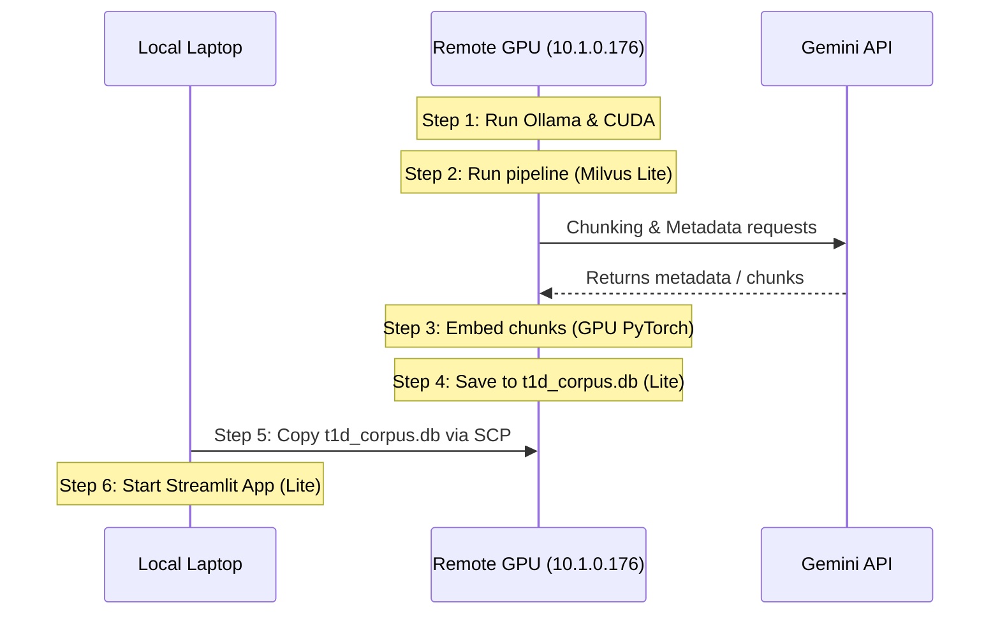

# Plan: Remote GPU Ingestion Migration with Milvus Lite

This plan outlines the steps to run the heavy ingestion pipeline on the remote GPU machine without root/sudo access, using Ollama (user-space) and Milvus Lite, then transferring the database back to the laptop for local hosting.

---

## 📋 Architectural Overview



---

## 🛠️ Step-by-Step Execution Plan

### Step 1: Update Codebase for Milvus Lite
Modify [store.py](file:///C:/Users/SHREY/Desktop/t1d_bot/src/corpus_store/store.py) to automatically use Milvus Lite when a `.db` file path is specified in `MILVUS_HOST`.

```diff
         # Connect to Milvus Client
         host = os.getenv("MILVUS_HOST", "localhost")
         port = os.getenv("MILVUS_PORT", "19530")
-        self.client = MilvusClient(uri=f"http://{host}:{port}")
+        if host.endswith(".db"):
+            # Milvus Lite file path
+            self.client = MilvusClient(uri=host)
+        else:
+            self.client = MilvusClient(uri=f"http://{host}:{port}")
```

---

### Step 2: Setup Remote Environment & Download Ollama

#### A. SSH to Remote GPU Head Node
```bash
ssh dgx-s-bmu-soet-230512@10.1.0.176
# Enter password
```

#### B. Download & Extract Ollama
Download and extract Ollama v0.5.7 directly on the head node (which has outbound internet access) to resolve dependencies and support offline/non-root execution:
```bash
rm -f ~/ollama
curl -L https://github.com/ollama/ollama/releases/download/v0.5.7/ollama-linux-amd64.tgz -o ollama-linux-amd64.tgz
tar -xzvf ollama-linux-amd64.tgz
```

#### C. Pre-download Model on Head Node (Internet Access Enabled)
Because the worker nodes/pods may not have direct outbound internet access, download the chunking/metadata model on the head node. Start a temporary background Ollama server (running on CPU) to pull the model files:
```bash
# Start server temporarily on the head node
~/bin/ollama serve > ~/ollama_head.log 2>&1 &

# Pull the chunking / metadata model (e.g. gemma2:9b)
~/bin/ollama pull gemma2:9b

# Stop the temporary Ollama process once complete
pkill ollama
```
*Note:* The model will be cached in your persistent home directory under `~/.ollama/models`.

---

### Step 3: Deploy GPU Pod

#### A. Create the Kubernetes Pod Manifest (`gpu-pod.yaml`)
Create `gpu-pod.yaml` in your home directory on the head node. The pod configuration must comply with the cluster restrictions:
1. **Namespace:** Use `dgx-s-bmu-soet-230512-restricted`.
2. **Volume Label Rule:** Include `app.kubernetes.io/name: local-storage` under `metadata.labels` to prevent volume scheduling errors.
3. **Container Image:** Use the pre-configured cluster PyTorch image `bmu-headnode:9443/nvcr.io/nvidia/pytorch:24.10-py3`.
4. **GPU Resource Limits:** Use the 18GB MIG partition `nvidia.com/mig-1g.18gb: 1` as namespace quotas restrict full GPU requests.
5. **Volume Types:** Set `type: Directory` for the user home directory mount and `type: DirectoryOrCreate` for the fast local NVMe private storage mount.

```yaml
apiVersion: v1
kind: Pod
metadata:
  name: gpu-interactive
  namespace: dgx-s-bmu-soet-230512-restricted
  labels:
    app.kubernetes.io/name: local-storage
spec:
  containers:
  - name: gpu-container
    image: bmu-headnode:9443/nvcr.io/nvidia/pytorch:24.10-py3
    command: ["/bin/bash", "-c", "while true; do sleep 3600; done"]
    resources:
      requests:
        cpu: "8"
        memory: "16Gi"
        nvidia.com/mig-1g.18gb: 1
      limits:
        cpu: "8"
        memory: "16Gi"
        nvidia.com/mig-1g.18gb: 1
    volumeMounts:
    - name: home-dir
      mountPath: /user-home
    - name: private-storage
      mountPath: /workspace
  volumes:
  - name: home-dir
    hostPath:
      path: /home/dgx-s-bmu-soet-230512
      type: Directory
  - name: private-storage
    hostPath:
      path: /workspace/private-storage/dgx-s-bmu-soet-230512
      type: DirectoryOrCreate
```

#### B. Apply the Pod Manifest
On the head node:
```bash
kubectl apply -f gpu-pod.yaml
```

#### C. Verify Pod Status
```bash
kubectl get pods -n dgx-s-bmu-soet-230512-restricted
```
Wait until the status transitions to `Running`.

---

### Step 4: Sync Code and Setup Python inside the Pod

#### A. Archive and Transfer Codebase
From your local laptop terminal, compress the codebase (excluding virtualenv, logs, and database files) and copy it to the head node:
```bash
# On Local Laptop:
tar -czvf t1d_bot.tar.gz --exclude="venv" --exclude=".git" --exclude="volumes" --exclude="*.db" -C C:\Users\SHREY\Desktop\t1d_bot .
scp t1d_bot.tar.gz dgx-s-bmu-soet-230512@10.1.0.176:~/
```

#### B. Access the Pod Container
Exec into the running Pod:
```bash
kubectl exec -it gpu-interactive -n dgx-s-bmu-soet-230512-restricted -- /bin/bash
```

#### C. Setup Code in High-Speed NVMe Workspace
Inside the container, extract the codebase directly onto the fast local NVMe private storage `/workspace` to maximize read/write performance during database ingestion:
```bash
# Verify GPU availability
nvidia-smi

# Extract code
mkdir -p /workspace/t1d_bot
tar -xzvf /user-home/t1d_bot.tar.gz -C /workspace/t1d_bot
cd /workspace/t1d_bot
```

#### D. Setup Python Virtual Environment
Initialize a virtual environment that uses `--system-site-packages` to inherit the pre-compiled high-performance PyTorch package bundled with the NGC container:
```bash
python3 -m venv venv --system-site-packages
source venv/bin/activate
pip install -r requirements.txt
pip install pymilvus>=2.4.2 transformers huggingface_hub prefect
```

---

### Step 5: Configure and Run Ingestion on GPU

#### A. Configure Environment File inside the Container
Create the environment configuration file `/workspace/t1d_bot/.env`:
```env
LLM_PROVIDER=ollama
OLLAMA_HOST=http://localhost:11434
CHUNKING_MODEL=gemma2:9b
METADATA_MODEL=gemma2:9b
GENERATION_MODEL=gemma2:9b
EMBEDDING_MODEL=BAAI/bge-m3

# Milvus Lite File Config (write directly to fast NVMe workspace)
MILVUS_HOST=t1d_corpus.db
MILVUS_COLLECTION=t1d_corpus
```

#### B. Start Ollama Server inside the Container
Start the Ollama server in the background, pointing the model search path to the persistent home directory:
```bash
export OLLAMA_MODELS=/user-home/.ollama/models
/user-home/bin/ollama serve > /workspace/ollama.log 2>&1 &
```

#### C. Run Ingestion Pipeline (Detached Session)
Execute the ingestion script. Run in the background using `nohup` to protect against terminal disconnections:
```bash
nohup python -m src.pipeline.run > pipeline.log 2>&1 &
```
* Monitor progress:
  ```bash
  tail -f pipeline.log
  ```
* BGE-M3 will automatically load on the GPU.

#### D. Backup Database and Cleanup
Once ingestion completes successfully, copy the database file to your persistent home directory:
```bash
cp /workspace/t1d_bot/t1d_corpus.db /user-home/t1d_corpus.db
```
Exit the container session. On the head node, delete the Pod to release resources:
```bash
kubectl delete pod gpu-interactive -n dgx-s-bmu-soet-230512-restricted
```

---

### Step 6: Transfer Database and Host Locally

#### A. Download Database to Local Laptop
From your local laptop terminal:
```bash
scp dgx-s-bmu-soet-230512@10.1.0.176:~/t1d_corpus.db C:\Users\SHREY\Desktop\t1d_bot\
```

#### B. Start Streamlit App Locally
Update local [C:\Users\SHREY\Desktop\t1d_bot\.env](file:///C:/Users/SHREY/Desktop/t1d_bot/.env):
```env
LLM_PROVIDER=gemini
MILVUS_HOST=t1d_corpus.db
MILVUS_COLLECTION=t1d_corpus
```

Start the Streamlit app:
```bash
conda run -n t1d streamlit run app.py
```

---

## 🎯 Verification Criteria

1. [ ] `store.py` compiles with Milvus Lite URI logic.
2. [ ] Ollama model `gemma2:9b` downloaded and running on remote GPU pod.
3. [ ] GPU Pod volume mounts successfully attached (Local-storage labeled, correct types).
4. [ ] Ingestion finishes successfully on GPU, generating `t1d_corpus.db`.
5. [ ] Local Streamlit launches and retrieves data from local `t1d_corpus.db`.

