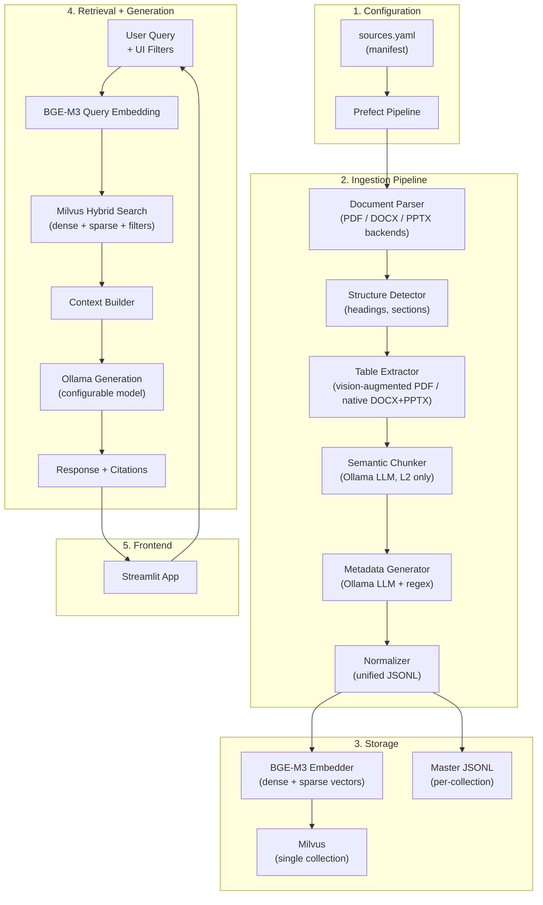

# T1D RAG Bot — Redesign Plan

> Expanding from structured ISPAD-only PDFs to a diverse, multilingual, multi-format corpus with a repeatable ingestion pipeline.

---

## Decision Log

| # | Area | Decision |
|---|---|---|
| 1 | Parsing | Unified parser abstraction (PyMuPDF + python-docx + python-pptx) → common `DocumentPage` IR |
| 2 | Tables | Critical — robust extraction (vision-augmented for PDFs, native for DOCX/PPTX) |
| 3 | Structure Detection | Format-native heuristics (DOCX heading styles, PDF font-size, PPTX slide titles). Drop ISPAD-specific rules |
| 4 | Chunking | L2 semantic chunking only. Drop L3 atomic extraction. Design for optional re-addition |
| 5 | Embedding | Switch from `multilingual-e5-large` → **BGE-M3** (8K context, hybrid dense+sparse) |
| 6 | Vector DB | Keep Milvus. Add sparse vector fields for BGE-M3 hybrid search |
| 7 | Bilingual | Embed in original language. Cross-lingual retrieval via BGE-M3. _Future: query-time translation fallback_ |
| 8 | Metadata | Universal schema: `source_document`, `collection`, `language`, `topic`, `content_type`, `keywords`, `contains_dosage`, `contains_recommendation` |
| 9 | Retrieval | BGE-M3 hybrid (dense + sparse) + metadata pre-filtering. No re-ranker |
| 10 | Query Filtering | Manual UI filters (Streamlit sidebar checkboxes) |
| 11 | Generation LLM | Ollama (local only). Model per task configurable via env/config |
| 12 | Citations | `Source: [Document Name], p.XX-YY` format |
| 13 | Pipeline | Config-driven YAML manifest + **Prefect** orchestration |
| 14 | Collection | Single Milvus collection, metadata filtering at query time |
| 15 | Document Grouping | Logical `collection` field in manifest (e.g., "ISPAD 2022", "Understanding Diabetes") |
| 16 | Scope | T1D-only. Filter non-T1D content via manual page ranges in manifest |
| 17 | Migration | Iterative: re-process ISPAD first → add expanded sources one by one |
| 18 | Evaluation | Deferred — manual testing initially |
| 19 | Frontend | Enhanced Streamlit with filters, source indicators, language toggle |
| 20 | API Flexibility | Ollama-first. See [note on LLM abstraction](#note-llm-abstraction-layer) |
| 21 | PPTX Support | `python-pptx` parser backend. Extract visible slide text + tables natively + images via Ollama vision. Slide titles as section headings. Slide number = page number for citations. No speaker notes. Full text fed through standard pipeline (structure detection → L2 chunking → metadata) |

---

## Architecture Overview



---

## Phase 1: Pipeline Foundation

### 1.1 Source Manifest (`sources.yaml`)

The manifest is the single source of truth for what documents exist and how to process them.

```yaml
# sources.yaml
defaults:
  chunking_model: "${CHUNKING_MODEL}"  # from .env
  metadata_model: "${METADATA_MODEL}"  # from .env

collections:
  - name: "ISPAD 2022 Guidelines"
    id: ispad_2022
    content_type: guideline
    language: english
    sources:
      - path: "dataset/raw/ISPAD-English-2022/Ch1_Definition_Epidemiology.pdf"
        format: pdf
        status: pending  # pending | processing | processed | error
      - path: "dataset/raw/ISPAD-English-2022/Ch2_Stages_of_T1D.pdf"
        format: pdf
        status: pending
      # ... all 19 chapters

  - name: "Understanding Diabetes Series"
    id: understanding_diabetes
    content_type: patient_education
    language: english
    sources:
      - path: "dataset/Expanded New Dataset/understanding diabetes/ud01.pdf"
        format: pdf
        status: pending
      # ... all 28 parts

  - name: "Williams Endocrinology"
    id: williams_endo
    content_type: textbook
    language: english
    sources:
      - path: "dataset/Expanded New Dataset/Williams Endocrinology New Edition.pdf"
        format: pdf
        include_pages: "850-920,1100-1180"  # T1D chapters only
        status: pending

  - name: "Hindi Patient Booklet"
    id: hindi_booklet
    content_type: patient_education
    language: hindi
    sources:
      - path: "dataset/Expanded New Dataset/Final Hindi booklet.pdf"
        format: pdf
        status: pending

  - name: "Diabetes Ward Education"
    id: ward_education
    content_type: patient_education
    language: english
    sources:
      - path: "dataset/Expanded New Dataset/diabetes education full for ward 18.8.15.docx"
        format: docx
        status: pending

  - name: "RSSDI Nutrition Guidelines"
    id: rssdi_nutrition
    content_type: guideline
    language: english
    sources:
      - path: "dataset/Expanded New Dataset/RSSDI Nutrition guidelines_PrintPDF.pdf"
        format: pdf
        status: pending

  - name: "Sperling Pediatric Endocrinology"
    id: sperling_ped_endo
    content_type: textbook
    language: english
    sources:
      - path: "dataset/Expanded New Dataset/Sperling Pediatric Endocrinology 5th ed 2021.pdf"
        format: pdf
        include_pages: "TBD"  # identify T1D chapters
        status: pending

  - name: "Brooks Pediatric Endocrinology"
    id: brooks_ped_endo
    content_type: textbook
    language: english
    sources:
      - path: "dataset/Expanded New Dataset/Brooks Ped Endocrinology 7th Edn.pdf"
        format: pdf
        include_pages: "TBD"  # identify T1D chapters
        status: pending

  - name: "Carb Counting Guide"
    id: carb_counting
    content_type: patient_education
    language: english
    sources:
      - path: "dataset/Expanded New Dataset/Nutrition basics and a quick guide to carbohydrate counting.pdf"
        format: pdf
        status: pending

  - name: "ISPAE Diabetes Guidelines 2017"
    id: ispae_2017
    content_type: guideline
    language: english
    sources:
      - path: "dataset/raw/ISPAE-Diabetes-Guidelines-2017.pdf"
        format: pdf
        status: pending

  - name: "DSMES Education Modules"
    id: dsmes_modules
    content_type: patient_education
    language: english
    sources:
      - path: "dataset/Expanded New Dataset/DSMES Modules/Admission and Discharge teaching.pptx"
        format: pptx
        status: pending
      - path: "dataset/Expanded New Dataset/DSMES Modules/NEW DSMES Session 1.pptx"
        format: pptx
        status: pending
      - path: "dataset/Expanded New Dataset/DSMES Modules/NEW DSMES Session 2.pptx"
        format: pptx
        status: pending
      - path: "dataset/Expanded New Dataset/DSMES Modules/NEW DSMES Session 3.pptx"
        format: pptx
        status: pending
```

### 1.2 Environment Configuration (`.env`)

```env
# LLM Models (Ollama)
CHUNKING_MODEL=gemma4:e4b
METADATA_MODEL=gemma4:e4b
GENERATION_MODEL=gemma4:e4b

# Embedding
EMBEDDING_MODEL=BAAI/bge-m3

# Milvus
MILVUS_HOST=localhost
MILVUS_PORT=19530
MILVUS_COLLECTION=t1d_corpus

# Ollama
OLLAMA_HOST=http://localhost:11434
```

---

## Phase 2: Document Parsing Layer

### 2.1 Unified Parser Abstraction

**What changes**: Replace `src/ingestion/pdf_extractor.py` with a format-agnostic parser.

```
src/ingestion/
├── parsers/
│   ├── __init__.py
│   ├── base.py          # Abstract base class + DocumentPage model
│   ├── pdf_parser.py    # PyMuPDF backend
│   ├── docx_parser.py   # python-docx backend
│   └── pptx_parser.py   # python-pptx backend
├── structure_detector.py  # NEW: replaces chapter_detector.py
├── table_extractor.py     # NEW: robust table extraction
├── chunker.py             # MODIFIED: remove L3, generalize prompts
├── metadata_generator.py  # MODIFIED: universal schema, Ollama
└── normalize.py           # MODIFIED: new schema, multi-source
```

**Intermediate Representation** (`DocumentPage`):

```python
@dataclass
class DocumentPage:
    page_number: int
    text_blocks: list[TextBlock]  # text + font_size + is_bold
    tables: list[str]            # markdown-formatted tables
    source_path: str
    
@dataclass
class TextBlock:
    text: str
    font_size: float
    is_bold: bool
    bbox: tuple[float, float, float, float] | None  # for PDFs
```

**PDF backend**: Wraps existing PyMuPDF extraction, adds `include_pages` filtering from manifest.

**DOCX backend**: Uses `python-docx` to extract paragraphs with heading levels, tables natively.

**PPTX backend**: Uses `python-pptx` to extract slide content. Each slide maps to a `DocumentPage` (slide number = page number). Extracts text from shape placeholders, tables from table shapes (markdown-formatted), and embedded images via Ollama vision model for text descriptions. Speaker notes are ignored. The full extracted text is concatenated and fed through the standard pipeline (structure detection → chunking → metadata).

### 2.2 Structure Detector

**What changes**: Replace `chapter_detector.py` (343 lines of ISPAD-specific logic) with a generic detector.

- **DOCX**: Read heading styles directly (`Heading 1`, `Heading 2`, etc.) — python-docx exposes these
- **PDF**: Generalized font-size heuristic — any text block with font size significantly above the median = heading. No hardcoded patterns like `N | HEADING`
- **PPTX**: Use slide title placeholders as section headings (each titled slide starts a new section)
- **Output**: List of `Section(title, level, start_page, end_page, content)`
- Drop all ISPAD-specific constants: `FORCED_SECTION_HEADINGS`, `SKIP_TITLES`, noise filters for "LIBMAN ET AL", Wiley URLs, etc.

### 2.3 Table Extraction

**What changes**: New `table_extractor.py` module.

- **DOCX**: python-docx `Document.tables` — native, reliable, handles merged cells
- **PDF simple tables**: Continue using PyMuPDF `page.find_tables()`
- **PDF complex tables** (merged cells, spanning headers): Send table-region image crops to the Ollama vision model for markdown conversion. This handles the complex textbook tables that PyMuPDF's heuristic extractor misses
- **PPTX**: python-pptx table shapes — native extraction, same approach as DOCX
- Tables are kept as atomic units in chunking (not split across chunks)

---

## Phase 3: Chunking & Metadata

### 3.1 Semantic Chunker (L2 Only)

**What changes in `chunker.py`**:

- **Remove all L3 extraction code** (`generate_l3_from_l2`, `L3_EXTRACTION_PROMPT`, L3 filtering heuristics)
- **Generalize chunking prompt**: Remove ISPAD-specific language ("clinical guidelines", "ISPAD"). Make the prompt content-type-aware:
  - For `guideline` content: emphasize preserving protocols, dosages, recommendations as complete units
  - For `textbook` content: emphasize preserving explanatory coherence, keeping examples with their concepts
  - For `patient_education` content: emphasize simple, self-contained chunks
- **Switch LLM to Ollama**: Replace `call_gemini()` with Ollama API call. Model from env config
- **Keep checkpoint/resume**: Valuable for large textbooks
- **Remove ISPAD skip logic**: Drop hardcoded chapter title skips (REFERENCES, CONFLICT OF INTEREST, etc.). Instead, use a generic `skip_sections` field in manifest per source if needed

> [!NOTE]
> **Designing for L3 re-addition**: The chunker output schema should include a `children` field (empty list for now). If L3 is re-added later, it populates this field. The normalizer and storage layers should handle `children=[]` gracefully.

### 3.2 Metadata Generator

**What changes in `metadata_generator.py`**:

**New universal schema** (per chunk):

```python
@dataclass
class ChunkMetadata:
    # Source identity
    source_document: str      # filename
    collection: str           # from manifest (e.g., "ispad_2022")
    content_type: str         # guideline | textbook | patient_education
    language: str             # english | hindi
    
    # Semantic
    topic: str                # expanded list (see below)
    keywords: list[str]       # LLM-generated
    
    # Clinical flags (universal, regex-based)
    contains_dosage: bool     # regex: numeric + clinical unit
    contains_recommendation: bool  # regex: should, must, recommend, protocol
```

**Expanded topic list**:
```
screening, diagnosis, monitoring, insulin_therapy, hypoglycemia, 
hyperglycemia, DKA, complications, epidemiology, nutrition, 
exercise, technology, psychosocial, sick_day_management, 
surgery, travel, pregnancy, general
```

**LLM switch**: Replace Gemini calls with Ollama. Model from env config.

**Keep regex overrides**: `contains_dosage` and `contains_recommendation` remain regex-based (reliable, language-agnostic for English; extend patterns for Hindi).

---

## Phase 4: Embedding & Storage

### 4.1 BGE-M3 Embedder

**What changes in `src/vector/embedding.py`**:

- Replace `intfloat/multilingual-e5-large` with `BAAI/bge-m3`
- BGE-M3 returns both dense (1024-dim) and sparse vectors from a single call
- Update prefix formatting: BGE-M3 doesn't require `"passage: "` / `"query: "` prefixes like E5 does
- Output: `(dense_vector: list[float], sparse_vector: dict[int, float])` per chunk

**VRAM**: ~2 GB FP32, ~1 GB FP16. Same as current E5-large.

### 4.2 Milvus Schema Update

**What changes in `src/vector/storage.py`**:

- **Collection name**: `t1d_corpus` (from env, replacing hardcoded `ispad_l2_chunks`)
- **New schema**:

```python
fields = [
    FieldSchema("id", DataType.VARCHAR, is_primary=True, max_length=128),
    FieldSchema("dense_embedding", DataType.FLOAT_VECTOR, dim=1024),
    FieldSchema("sparse_embedding", DataType.SPARSE_FLOAT_VECTOR),
    FieldSchema("text", DataType.VARCHAR, max_length=65535),
    
    # Metadata fields (filterable)
    FieldSchema("source_document", DataType.VARCHAR, max_length=256),
    FieldSchema("collection", DataType.VARCHAR, max_length=128),
    FieldSchema("content_type", DataType.VARCHAR, max_length=64),
    FieldSchema("language", DataType.VARCHAR, max_length=16),
    FieldSchema("topic", DataType.VARCHAR, max_length=64),
    FieldSchema("contains_dosage", DataType.BOOL),
    FieldSchema("contains_recommendation", DataType.BOOL),
    FieldSchema("start_page", DataType.INT64),
    FieldSchema("section_title", DataType.VARCHAR, max_length=512),
    FieldSchema("keywords", DataType.VARCHAR, max_length=1024),  # JSON array as string
]
```

- **Indexes**: HNSW on `dense_embedding`, inverted index on `sparse_embedding`, scalar indexes on metadata fields
- **Idempotent upsert**: Check by `id` before inserting. Support incremental additions

### 4.3 Master JSONL

**Updated normalized row schema**:

```json
{
  "retrieval_id": "ispad_2022__ch01__001",
  "chunk_level": "L2",
  "content": {
    "text": "...",
    "token_estimate": 280
  },
  "hierarchy": {
    "collection": "ispad_2022",
    "document": "Ch1_Definition_Epidemiology.pdf",
    "section_title": "Introduction",
    "parent_id": null,
    "child_ids": []
  },
  "source": {
    "start_page": 1,
    "source_document": "Ch1_Definition_Epidemiology.pdf"
  },
  "metadata": {
    "content_type": "guideline",
    "language": "english",
    "topic": "epidemiology",
    "keywords": ["type 1 diabetes", "incidence", "prevalence"],
    "contains_dosage": false,
    "contains_recommendation": true
  }
}
```

---

## Phase 5: Retrieval

### 5.1 Hybrid Retriever

**What changes in `src/retrieval/`**:

- **Remove KV store hierarchy expansion**: No more L2→L3 lookup (L3 doesn't exist)
- **Simplify to direct retrieval**: Query → embed → hybrid search → return chunks

**Retrieval flow**:
1. Embed query with BGE-M3 → `(dense_query, sparse_query)`
2. Apply user-selected metadata filters (from UI) as Milvus filter expressions
3. Run hybrid search: weighted combination of dense + sparse scores
4. Return top-K chunks with metadata

```python
# Pseudocode
def retrieve(query: str, top_k: int, filters: dict) -> list[RetrievalResult]:
    dense_vec, sparse_vec = embedder.embed_query(query)
    
    filter_expr = build_filter_expr(filters)  
    # e.g., 'content_type in ["guideline"] and language == "english"'
    
    results = milvus.hybrid_search(
        collection="t1d_corpus",
        dense_vector=dense_vec,
        sparse_vector=sparse_vec,
        filter=filter_expr,
        limit=top_k,
        output_fields=["text", "source_document", "collection", 
                       "content_type", "start_page", "section_title", ...]
    )
    return results
```

### 5.2 No Re-ranker

Per decision: rely on BGE-M3 hybrid scoring. If precision issues arise on the diverse corpus, a re-ranker (`bge-reranker-v2-m3`) can be added as a post-processing step without changing the retrieval architecture.

---

## Phase 6: Generation

### 6.1 Prompt Builder

**What changes in `src/generation/prompt_builder.py`**:

- **Remove L3 formatting**: No more `[ATOMIC FACTS - L3]` section
- **Update context block format**: Include source authority info

```
--- RETRIEVED CONTEXT [1] ---
Source: Williams Endocrinology (Textbook), p.865
Section: Insulin Therapy in New-Onset T1D
[CONTENT]
The initial insulin dose for newly diagnosed...
---
```

- **Update citation instruction in system prompt**: Instruct LLM to cite as `[Source Name, p.XX]`
- **Language-aware prompt**: Detect query language. If Hindi, add instruction to respond in Hindi
- **Keep anti-hallucination rules**: Only use retrieved context, explicit "not enough info" response

### 6.2 Generator

**What changes in `src/generation/generate.py`**:

- **Switch from Ollama `gemma4:e4b` hardcode to configurable model** from env
- **Update source extraction**: Build citations as `"Document Name, p.XX-YY"` from chunk metadata
- **Remove L3/KV store dependencies**

---

## Phase 7: Frontend Enhancements

### 7.1 Streamlit UI Updates

**Sidebar filter panel**:
```
📚 Content Filters
├── Content Type: ☑ Guidelines  ☑ Textbooks  ☑ Patient Education
├── Language: ☑ English  ☑ Hindi
├── Collection: [Multi-select dropdown]
│   ├── ISPAD 2022
│   ├── Williams Endocrinology
│   ├── Understanding Diabetes
│   └── ...
├── Contains Dosage: ☐ (optional filter)
├── Contains Recommendation: ☐ (optional filter)
└── Top-K: [slider 1-10, default 5]
```

**Source authority indicators** in response:
```
📋 Sources:
  🏥 ISPAD 2022 Guidelines, Ch.8, p.12 (Guideline)
  📖 Williams Endocrinology, p.867 (Textbook)
  📄 Understanding Diabetes, Part 5, p.3 (Patient Education)
```

**Language toggle**: Button in sidebar to switch UI language (English/Hindi).

---

## Phase 8: Prefect Pipeline Orchestration

### 8.1 Pipeline Structure

```python
# src/pipeline/flows.py
from prefect import flow, task

@task(retries=2, retry_delay_seconds=30)
def parse_document(source_config: dict) -> list[DocumentPage]:
    ...

@task(retries=2)
def detect_structure(pages: list[DocumentPage]) -> list[Section]:
    ...

@task(retries=2)
def extract_tables(pages: list[DocumentPage]) -> list[DocumentPage]:
    ...

@task(retries=2)
def chunk_sections(sections: list[Section], model: str) -> list[Chunk]:
    ...

@task(retries=2)
def generate_metadata(chunks: list[Chunk], model: str) -> list[Chunk]:
    ...

@task
def normalize(chunks: list[Chunk], collection_config: dict) -> str:
    """Returns path to output JSONL"""
    ...

@task
def embed_and_store(jsonl_path: str) -> int:
    """Returns count of vectors stored"""
    ...

@flow(name="process-source")
def process_source(source_config: dict, collection_config: dict):
    pages = parse_document(source_config)
    pages = extract_tables(pages)
    sections = detect_structure(pages)
    chunks = chunk_sections(sections, model=os.getenv("CHUNKING_MODEL"))
    chunks = generate_metadata(chunks, model=os.getenv("METADATA_MODEL"))
    jsonl_path = normalize(chunks, collection_config)
    count = embed_and_store(jsonl_path)
    return count

@flow(name="process-manifest")
def process_manifest(manifest_path: str = "sources.yaml"):
    """Process all pending sources from the manifest."""
    manifest = load_manifest(manifest_path)
    for collection in manifest["collections"]:
        for source in collection["sources"]:
            if source["status"] == "pending":
                process_source(source, collection)
                update_manifest_status(source, "processed")
```

### 8.2 Running the Pipeline

```bash
# Process all pending sources
python -m src.pipeline.run

# Process a specific collection
python -m src.pipeline.run --collection ispad_2022

# Prefect dashboard (optional)
prefect server start
```

---

## Phase 9: Migration Plan

### Execution Order

```
Step 1: Infrastructure
  ├── Set up .env with model configs
  ├── Create sources.yaml manifest
  ├── Update docker-compose.yml (if Milvus schema changes require fresh collection)
  └── Verify: Milvus running, Ollama models pulled

Step 2: Core Pipeline Modules
  ├── Build parsers/ (PDF + DOCX + PPTX backends)
  ├── Build structure_detector.py (generic)
  ├── Build table_extractor.py
  ├── Modify chunker.py (remove L3, generalize prompts, switch to Ollama)
  ├── Modify metadata_generator.py (universal schema, switch to Ollama)
  ├── Modify normalize.py (new schema)
  └── Verify: Process a single ISPAD chapter end-to-end

Step 3: Embedding & Storage
  ├── Update embedding.py (BGE-M3)
  ├── Update storage.py (new schema, hybrid vectors)
  └── Verify: Embed + store a single chapter, query it

Step 4: Retrieval & Generation
  ├── Update retrieve.py (hybrid search, remove KV store expansion)
  ├── Update prompt_builder.py (new citation format, language-aware)
  ├── Update generate.py (configurable model, new source format)
  └── Verify: Ask a question, get a cited answer from the single chapter

Step 5: Re-process ISPAD
  ├── Process all 19 ISPAD chapters through new pipeline
  ├── Compare retrieval quality against old system (manual spot-check)
  └── Verify: Old evaluation questions still get good answers

Step 6: Add Expanded Sources (one at a time)
  ├── Understanding Diabetes series (28 PDFs — good test of batch processing)
  ├── ISPAE Guidelines 2017 (guideline format, tests generalized structure detection)
  ├── Hindi Booklet (tests bilingual pipeline)
  ├── Ward Education DOCX (tests DOCX parser)
  ├── DSMES Modules PPTX (tests PPTX parser + vision image extraction)
  ├── Nutrition guides
  ├── Textbooks (largest — process T1D chapters only)
  └── Verify: After each, spot-check retrieval quality

Step 7: Prefect Orchestration
  ├── Wrap pipeline stages as Prefect tasks/flows
  ├── Add retry logic, logging, status tracking
  └── Verify: Process a new source via `python -m src.pipeline.run`

Step 8: Frontend Enhancements
  ├── Add filter sidebar
  ├── Add source authority indicators
  ├── Add language toggle
  ├── Update citation display
  └── Verify: End-to-end user flow with filters
```

---

## Note: LLM Abstraction Layer

> [!TIP]
> **Is pre-programming support for different LLM APIs unnecessarily tedious?**
> 
> **No — it's actually straightforward.** The codebase already has two LLM touchpoints: chunking/metadata (currently Gemini) and generation (currently Ollama). Both use simple `chat()` calls. A thin wrapper with a common interface would take ~50 lines:
> 
> ```python
> class LLMClient:
>     def chat(self, messages: list[dict], model: str, temperature: float) -> str: ...
> 
> class OllamaClient(LLMClient): ...   # wraps ollama.chat()
> class GeminiClient(LLMClient): ...   # wraps genai.chat()
> class OpenAIClient(LLMClient): ...   # wraps openai.chat()
> ```
> 
> **Recommendation**: Build the `OllamaClient` wrapper now (you need it anyway). Adding `GeminiClient` or `OpenAIClient` later is a 20-line addition each. The abstraction pays for itself if you ever switch models or want to A/B test providers.

---

## Note: Future Enhancements

These were discussed and deferred. Documenting for future reference:

1. **L3 Atomic Extraction**: Re-add as optional enrichment for guideline content. Controlled by `content_type` in manifest. Pipeline already structured with `child_ids: []` placeholder
2. **Query-time Translation Fallback**: If cross-lingual retrieval quality is poor (Hindi query → English chunks), add a translation step: detect query language → translate to English → retrieve → translate response back. BGE-M3 should handle this without translation, but monitor quality
3. **Re-ranker**: Add `bge-reranker-v2-m3` as post-retrieval re-scoring if precision degrades with larger corpus
4. **Automated Evaluation**: Build a 50+ question bank covering all content types/languages. Use LLM-as-judge for regression testing
5. **Dynamic Query Filtering**: Replace manual UI filters with rule-based query analysis that auto-infers appropriate filters

---

## File Changes Summary

| File | Action | Description |
|---|---|---|
| `sources.yaml` | **NEW** | Document manifest with collections, sources, page ranges |
| `.env` | **MODIFY** | Add model configs per task |
| `src/ingestion/parsers/base.py` | **NEW** | `DocumentPage`, `TextBlock`, `Section` models + abstract parser |
| `src/ingestion/parsers/pdf_parser.py` | **NEW** | PyMuPDF backend (evolves from `pdf_extractor.py`) |
| `src/ingestion/parsers/docx_parser.py` | **NEW** | python-docx backend |
| `src/ingestion/parsers/pptx_parser.py` | **NEW** | python-pptx backend (text + tables + vision-based image extraction) |
| `src/ingestion/structure_detector.py` | **NEW** | Generic heading detection (replaces `chapter_detector.py`) |
| `src/ingestion/table_extractor.py` | **NEW** | Robust table extraction with vision fallback |
| `src/ingestion/chunker.py` | **MODIFY** | Remove L3, generalize prompts, switch to Ollama |
| `src/ingestion/metadata_generator.py` | **MODIFY** | Universal schema, switch to Ollama |
| `src/ingestion/normalize.py` | **MODIFY** | New schema, multi-source support |
| `src/vector/embedding.py` | **MODIFY** | Switch to BGE-M3, return dense+sparse |
| `src/vector/storage.py` | **MODIFY** | New collection schema, sparse vectors, idempotent upsert |
| `src/retrieval/retrieve.py` | **MODIFY** | Hybrid search, remove KV store expansion |
| `src/retrieval/kv_store.py` | **MODIFY/SIMPLIFY** | Remove L3 hierarchy, simplify to chunk lookup |
| `src/generation/prompt_builder.py` | **MODIFY** | New citation format, language-aware, remove L3 |
| `src/generation/generate.py` | **MODIFY** | Configurable model, new source format |
| `src/pipeline/flows.py` | **NEW** | Prefect flow definitions |
| `src/pipeline/run.py` | **NEW** | CLI entry point |
| `app.py` | **MODIFY** | Filter sidebar, source indicators, language toggle |
| `src/ingestion/pdf_extractor.py` | **DELETE** | Replaced by `parsers/pdf_parser.py` |
| `src/ingestion/chapter_detector.py` | **DELETE** | Replaced by `structure_detector.py` |
